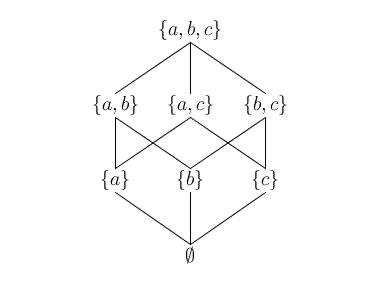

# Global Initialization Checker Rewrite Progress

### Written by Ryan Maxin

[Link](https://ryanmaxin.github.io/ura-progress/)

[Code here](https://github.com/Ryanmaxin/scala3)

## Weeks

### June 8, 2026 - June 15, 2026

#### Progress

_Goals:_

- [x] Add cycle detection, simple dependency analysis for conservative checker.
  - At first I did all dependencies at once, then check for cycles but this is less realistic
- [x] Decide on structure for the progress document (this)
- [x] Formalize the abstract domain. Add it to the top of the code file.

_Additional:_

- Built small testing harness so that I can switch back and forth between the old and new initialization checker (and later the precise one)
- Started building up my own small test suite, I can merge this in later
- Learned more about lattices, solidifed the Kleene's least fixed point theorem that I missed from class
- Uploaded this progress file to a github pages that can be shared and updated

#### Topics

- [x] How should I share my code changes? Should I fork or branch from the official scala compiler. Whats the process to get it merged? https://github.com/scala/scala3/branches/all From branches, we see that they don't seem to allow random branches
- [x] How is my abstract domain?
  - [x] The whole point of the domain is to build a lattice, which proves that we have a fixed point (IE the program will terminate).
  - [x] The fixed point could still be massive in practice?
  - [x] What should be the top exactly?
  - [x] When should I add in "corrupting" informaiton (IE unknown info, incomputable info, when to "give up" on the computation?), corruption spreads with join?
  - [x] Should the RM, dep be defined as part of the abstract domain, should they be lattices aswell?
  - [x] This is the idea here?
        <br>
        
  - [x] I was weak on order theory, LUB, GLB, Kleene's least fixed point theorem.
    - [x] Kleene's least point formula is really simple in practice but it is written complicated. It seems trivially true in my case.
    - [x] The example I started with here is super simple to create our lattice, the hard part is making sure its a lattice, how difficult is it?

### June 16, 2026 - June 26, 2026

#### Progress

_Goals:_

- [x] Implement eval (get as far as possible)
  - [x] One of those cases is if its a read, check if its unowned mutable state.
  - [x] One (or maybe a few) will be method calls which will have to interact with RM
    - NOTE: Will have to think about how to deal with potentially analyzing methods multiple times with different arguments
  - [x] A few will interact with IC, need to fill those out as we keep iterating
  - [x] Look into the repeated iteration/finding the fixed point

_Additional:_

- [x] [Fork code here](https://github.com/Ryanmaxin/scala3)
  - Scala staging allows branches, may need special access
    - Main benefit of staging, is that others can push to my pr
    - This isn't really a benefit for me though
  - I chose to just create a fork
- [x] Finished complete abstract domain
  - _NOTE:_
    - L1 x L2 => Still a lattice
    - f -> L => Still a lattice (A bunch of small lattices form a big lattice)

#### Topics

- [x] Do we know our full lattice actually has a fixed height? It seems intuitive to me but you told me that in the past with nested classes we had some issues.
- [x] Too many details for the abstract domain? What do you prefer?
- [x] How much complexity/creativty in the data structures?
- Cool scala feature: extension
- [x] Do I want to replicate the current code?
- [x] eval is way overkill for our needs, is it still good to keep it?
- [x] Thoughts on "Scan State". What is abstract domain, what is machinery?
- [x] AI recommends passing it everywhere to avoid implicit state. My mind says to just make it a member of each global object, like summaries.
- [x] Should eval() return our Set[OwnedClass]?
- [x] What exactly is Apply?
- [x] Do we actually want visibleObjects?
- [x] Idea: give mutables a type? Check on that
- [x] Idea: Graph reachability URA?
- [x] Idea of initializers being ran just like methods?

### June 27, 2026 - July 3, 2026

#### Progress

_Goals:_

- [x] Make sure all of the tree matching cases are covered (make the default case crash) (fix as they come up)
- [?] Unify method exploration and class init
- [?] Fix sel @ Select()
  - [x] Clean up valueOf
- [x] Make improvements suggested from the notes section
- [ ] Get it running on the existing tests (fix some bugs)
  - [ ] Classify existing tests (more precise one will fix?)
  - [ ] Maybe make some fancier tests?
- [x] Turn back on instance checker pass for global init

_Additional:_

- [x] Warn on cases fallthrough instead of using valueOf
- [ ] Make scanState implictly passed (given/using)
- [x] Pull out warnMutableAccess into checkForMutableAccess for clarity
- [x] Made mutable read warning no longer take OwnedClass(A,A) (IE, global object no longer held in owned class)
- [ ] Add lazy val handling
  - Look into how lazy is dealt with in my currnt code (look into old code, how it handles it)
  - missing lazy vals on select
  - Note: Maybe used cachedeval (in the original code) for lazy
- [?] Confirmed all basic test cases are correct

#### Topics

- [] Should we have global object owns a global object?
- [] For unqualified calls, what should we use as the receiver. Empty set? The current object?
- SELECT
  - [] Do we need a fallaback for selectedValue (indent and select)
  - [] Did I fix select?
  - [] On failure to find, should we inherit from qualifiers?
  - class Config (what if we keep going?):

  ```
    var port: Int = 21

    class Server:
    val config: Config = loadConfigSomehow()

    object A:
    val server: Server = makeServer()
    val port = server.config.port
  ```

  - [] AI says that Assign case is needed, because we dont want to run into the select case, since we are writing, not reading? Current checker does the same thing.
  - [] What did we want to do for the unification again? Like this?
    ```
    enum ReachableDef:
      case Method(sym: Symbol)
      case ClassInit(cls: ClassSymbol)
    ```
  - [] We've talked about the theory behind efficency improvements. Should i actually implement?
  -

  ```
  // Ownership note:
  //
  // There are two different notions of "owner" here:
  //
  //   1. Symbol owner:
  //      Where a member was declared in the program.
  //      Example:
  //        class Server:
  //          val config: Config = new Config
  //
  //      The symbol for `config` is owned by class `Server`.
  //      That does NOT mean a particular `Config` value is owned by `Server`.
  //      `Server` is just the declaring class.
  //
  //   2. Abstract value owner:
  //      Which global object owns the runtime mutable state represented by an
  //      `OwnedClass(owner, cls)` fact.
  //      Example:
  //        object B:
  //          val server: Server = new Server
  //
  //      While analyzing object `A`, the expression `B.server` should produce:
  //        OwnedClass(B, Server)
  //
  // For direct static-object members, the symbol owner is enough:
  //   object B:
  //     val box: Box = new Box
  //
  //   B.box
  //     symbol owner = B
  //     abstract value = OwnedClass(B, Box)
  //
  // But for ordinary instance fields, the symbol owner is not enough:
  //   class Server:
  //     val config: Config = new Config
  //
  //   object B:
  //     val server: Server = new Server
  //
  //   object A:
  //     val c = B.server.config
  //
  // The symbol for `config` is owned by class `Server`, not by object `B`.
  // However, the receiver `B.server` is owned by `B`, so we probably want:
  //   B.server.config => OwnedClass(B, Config)
  //
  // This suggests the following ownership rule:
  //
  //   - If a selected symbol is directly owned by a static object, use that object.
  //     Example: `B.box` => OwnedClass(B, Box)
  //
  //   - Otherwise, for instance selections, inherit ownership from the receiver.
  //     Example: `B.server.config` should inherit owner `B` from `B.server`.
  //
  //   - If we only have a type and no useful owner information, default to `root`.
  //     Example: while analyzing `A`, a method result of type `Box` becomes
  //     OwnedClass(A, Box).
  //
  // The open design question is whether `valueFromTree(Select(...))` should
  // currently fall back to `valueFromType(sel.tpe, root)` or instead use the
  // receiver's owner(s), e.g. `valueFromTypeOwnedBy(sel.tpe, receiverOwners)`.
  ```

- Remainders:
  - Check for redundant work on super calls (templates vs scan class init)
  - If the symbol is a static object, need to do an access
  - Redundant joinIC(). Fix it!
- Basic test cases, look at:
  - MutableReadDirect.scala (too course)
  - MethodObjectCycle (misses cycle without crazy logic)

### July 4, 2026 - July 9, 2026

#### Progress

_Goals:_

## Future todos (Add and remove as needed)

- Update test checks (only when the checker is in a better place)
- Filter the global init checker tests to be properly focused on the features of the new checker

- Optimize stack traversal for dependency finding
- Optimize calling methods as few times as possible (collect all possible arguments first maybe? Use an observer to rerun only when possible args changes?)
- Add back edge traces, logging
- Define abstract domain, lattice, for the precise checker
- Implement mutable read detection on simple domain
- Look into optimizations for the init checker
- Maybe use a double ended queue for drain method ordering?
- Read `this` context?
- Add local environment to the abstract domain

- evaltype:
  - old code uses evalType for context specific (like name binding)
  - In ident, need to look at the type to infer the implict qualifier (use termref) (look into old object init code) (termref has another termref as its qualifier/prefix)
  - Will want something like evaltype() in the old code (for select and ident at first, but probably useful elsewhere)

- Ideas:
  - Analysis uses place in lattice as both input and output
  - Assume some RM and IC.
  - Run all RM, update IC and RM with new information found
  - function is from lattice state -> new lattice state
  - Find an input st when I give it to the analysis, the output is the same as the input
  - IE f(x) = x
  - In terms of implementation:
  - 1. Simple analysis, lattice state as input, lattice state as output
    - Just check is it the same as the input
    - Easy but inefficent.
    - (Ex: 1000 RM, add one more, now we scan all 1000 again)
  - 2. Track all the changes that may happen
    - For each of these potential changes, check what else they will affect.
    - Like an event handler
    - Much more complicated, and hard to get right, but much more efficent

  - Maybe for the super simple case we try to do part 2, since there are only a few side effects from changing something.
  - To handle new instantiated class:
  - Idea: reprocess all RM with the new set of classes
  - Better Idea: while processing methods, create list of call sites. I have a new IC, we revisit all the call sites for just the new IC
  - Super simple would be no ScanState
  - Examine tree structure for basic cases
  - USe vprint, scala -V <- This will print "scala" like code
  - Look for the argument that lets you see the node names directly
    - Probably one of the -x options (-Xprint-types?)
    - -Vprint:typer <- LOOK UP THE PASS JUST BEFORE GLOBAL INIT CHECKER
    - -Vprint:typer -Yplain-printer <- Try this one for examining trees. Compare it to just the Vprint:typer one. This one has the actual type names of nodes (useful for eval() implementations)

  - Could optimize iteration to be on a per iteration basis (A->B , if B changes, rerun A, if A changes, dont rerun B) (Add to todo list)

## Notes:
